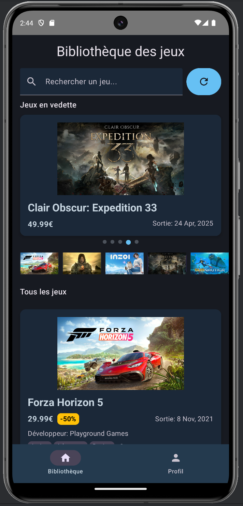

# SteamCheck - Application Multiplateforme

## Auteurs
ESGI 3AL 2024-2025: 
- Thomas Dusséaux
- Pierre-Henri Luczak

## Description
SteamCheck est une application Kotlin Multiplatform (KMP) qui permet de consulter les détails des jeux Steam ainsi que les statistiques des utilisateurs Steam. L'application vous permet de rechercher des jeux, consulter leurs détails et voir les statistiques de votre compte Steam.



## Architecture du Projet

### Vue d'ensemble
L'application est structurée selon le pattern MVVM (Model-View-ViewModel) et utilise l'architecture Clean Architecture pour une séparation claire des responsabilités.

### Structure des dossiers

```
SteamCheck/
├── composeApp/
│   └── src/
│       └── commonMain/
│           ├── kotlin/org/steamcheck/project/
│           │   ├── data/           # Couche données
│           │   │   ├── remote/     # Sources de données distantes (APIs)
│           │   │   └── dto/        # Objets de transfert de données
│           │   ├── domain/         # Logique métier et Use Cases
│           │   ├── presentation/   # UI et ViewModels
│           │   └── utils/          # Utilitaires et constantes
│           └── resources/          # Ressources partagées
├── androidApp/                     # Application Android
└── desktopApp/                     # Application Desktop
```

### Composants principaux

#### Module commun (composeApp)
- **Data Layer**: 
  - `remote`: Implémente les APIs pour récupérer les données
  - `dto`: Classes représentant les données reçues des APIs
- **Domain Layer**: 
  - `usecase`: Contient la logique métier pour les cas d'utilisation
  - `model`: Modèles de données de l'application
- **Presentation Layer**: 
  - `viewmodel`: ViewModels partagés entre les plateformes
  - `ui`: Composants d'interface utilisateur avec Compose

#### Plateformes spécifiques
- **androidApp**: Interface utilisateur Android avec Jetpack Compose
- **desktopApp**: Interface utilisateur Desktop avec Compose Multiplatform

### Technologies utilisées

- **Kotlin Multiplatform**: Pour le partage de code entre plateformes
- **Compose Multiplatform**: Pour l'interface utilisateur multiplateforme
- **Ktor**: Pour les appels réseau vers les APIs
- **Kotlinx.serialization**: Pour la sérialisation/désérialisation JSON

### APIs utilisées

#### Steam Store API
- Utilisée pour récupérer les informations sur les jeux
- Endpoints principaux:
  - `https://store.steampowered.com/api/featuredcategories`: Pour les jeux en vedette
  - `https://store.steampowered.com/api/appdetails`: Pour les détails d'un jeu
  - `https://store.steampowered.com/api/storesearch`: Pour la recherche de jeux

#### Steam Web API
- Utilisée pour récupérer les informations sur les utilisateurs
- Endpoints principaux:
  - `https://api.steampowered.com/ISteamUser/GetPlayerSummaries/v2`: Pour les informations utilisateur
  - `https://api.steampowered.com/IPlayerService/GetOwnedGames/v0001`: Pour la liste des jeux possédés
  - `https://api.steampowered.com/ISteamUserStats/GetPlayerAchievements/v1`: Pour les succès des joueurs

### Flow de données

1. L'UI interagit avec les ViewModels (GamesListViewModel, UserStatsViewModel)
2. Les ViewModels appellent les Use Cases (GetGamesUseCase, SearchGamesUseCase, GetUserDataUseCase)
3. Les Use Cases orchestrent les appels aux APIs (StoreApi, SteamApi)
4. Les données sont renvoyées à l'UI pour affichage

### Configuration et déploiement

Pour compiler et exécuter le projet :

```bash
# Android
./gradlew :androidApp:assembleDebug

# Desktop
./gradlew :desktopApp:run
```

### Exemples d'écrans
- Liste des jeux en vedette
- Profil utilisateur avec statistiques
- Recherche de jeux
